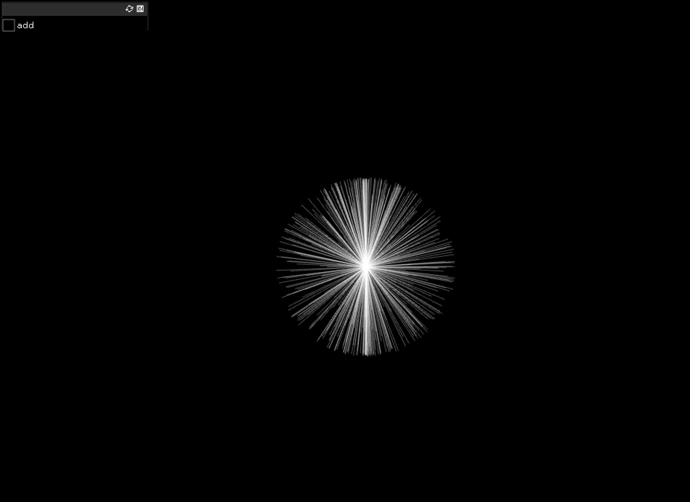
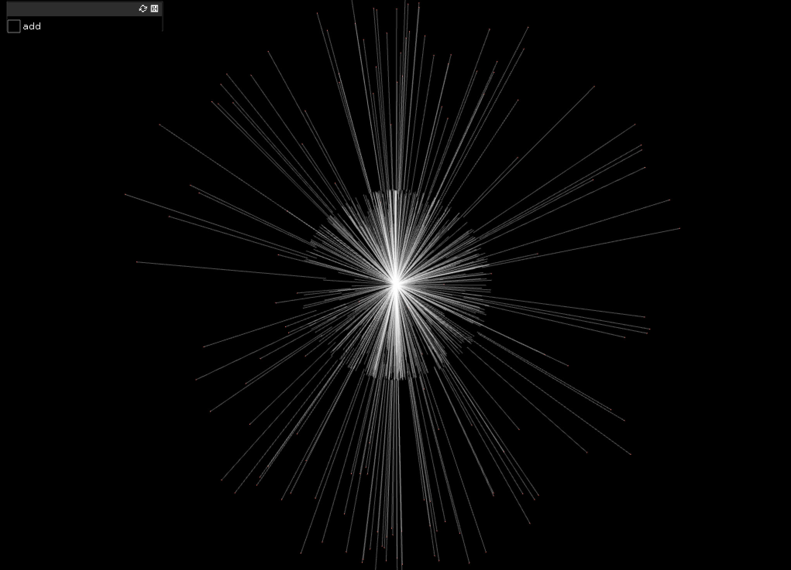

##Particle Adder

This project generates points and lines around a central core every time the button is pressed. The points are generated randomly based on sin cos variables and the button is a simple gui button.

void ofApp::setup(){
    
    gui.setup(); // most of the time you don't need a name
    gui.add(addit.setup("add"));

In the setup the gui and variable used for the button are initiated.

Next the points are generated based on the button pressed creating a random array of light. 

Also there are hidden commands to clear the current point and zoom the camera in and out.

void ofApp::keyPressed(int key) {
    
    if(key == OF_KEY_UP) {
        camDist -= 10;
    }
    if(key == OF_KEY_DOWN) {
        camDist += 10;
    }
    camera.setDistance(camDist);
    
    
    // clear all the points
    if(key == 'c') {
        points.clear();
    }